This project deals with creating an e-commerce application for Generic Medicine.  
-With the Application the users can search and buy the generic medicine they want.   
-Users can also search the application for the generic medicines according to their symptoms, or search by the prescribed medicines suggested by the doctors, to find their respective generic medicines.   
-Users will be able to add those medicines in their wish list or in the cart or even buy those medicines from the store if they want.  

Extract all the files.

Screenshots: 
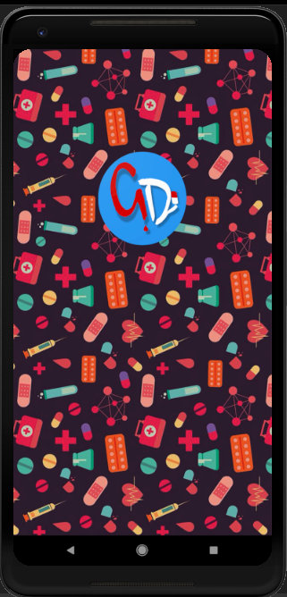
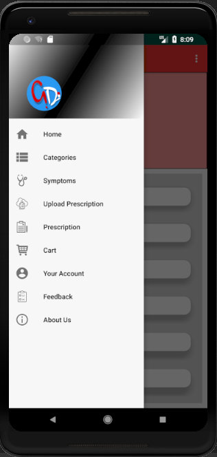

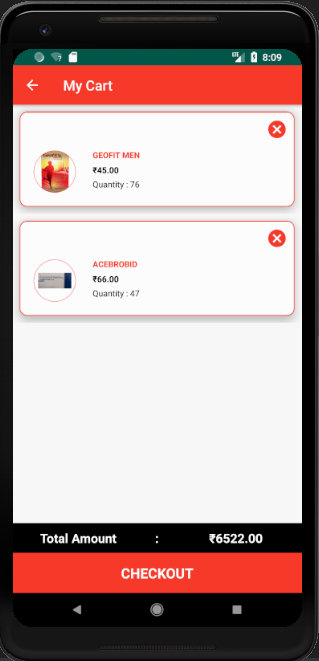
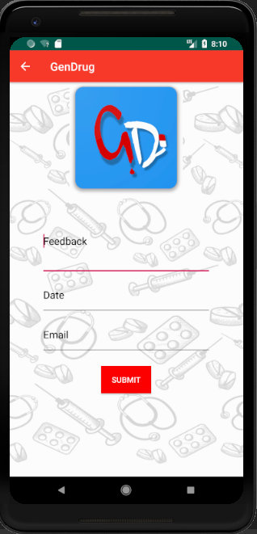
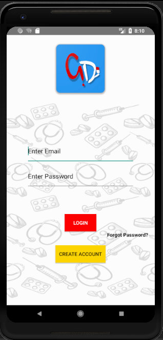
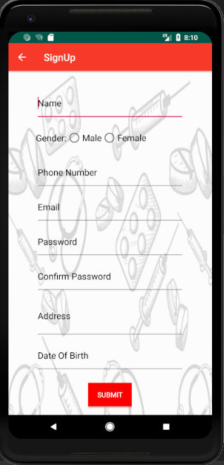
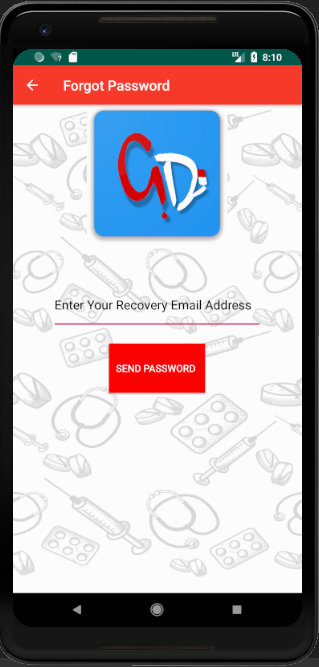
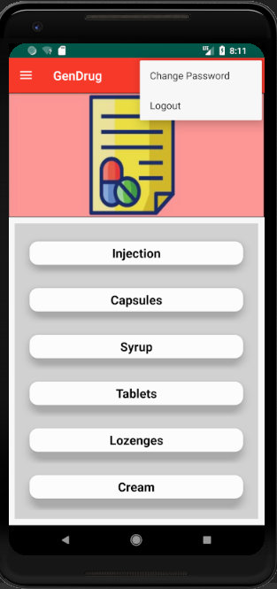
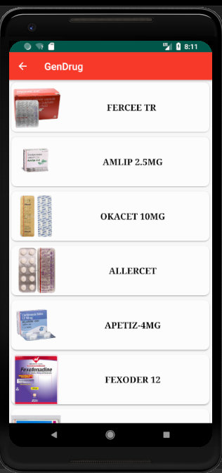
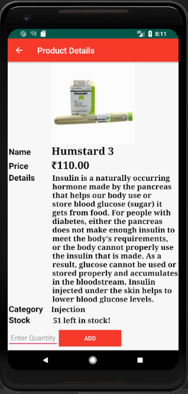
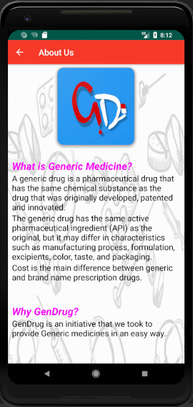
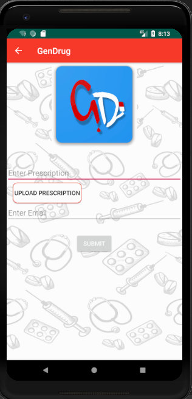
